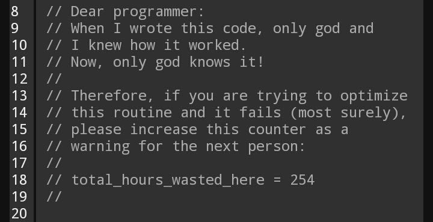

# _Sara's README_ 
 

**Welcome** 

_I'm Sara Itzel Garcia Vidal. My id is UP210612. And i'm currently on ISC03A._

Here you'll be able to find what i'm suppoued to learn on this quarter. However I would like to leave this warning that you should remember whenever you're trying to understand how my program works: 

Hey! You're still here :)

Well thanks for that. Now let's get into the important stuff. 

| Unit | Name  |
| ----- | ------ |
| U1 |  Programing introduction|
| U2  | Control structures & cycles|
| U3 |  Functions |
| U4 | Files & arrays | 

## So now, please let me show you some of the GIT commands I've been ussing a lot. 

| Command  | Function  |
| ----- | ------ |
| Git status | Let's me know the status of the files I've been working on in my laptop, that need to be synchronized with my repository|
| Git add .  | Includes all the not synchronized documents that I want to upload|
| Git commit -m " " |  Creates a kind of package that will contain all the files I want to add to my repository |
| Git push | Is going to send the package to the repository | 
| Git clone |  It helps to make a copy of a repository into an external device |

