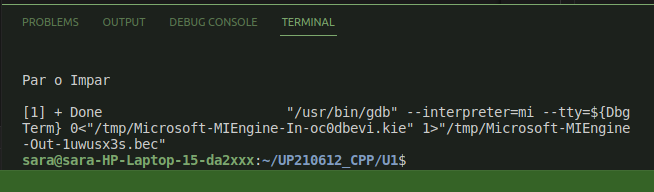
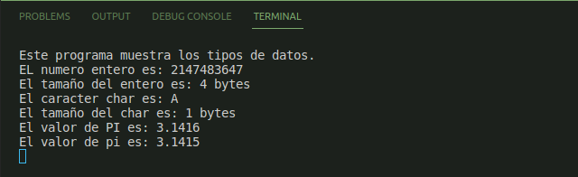
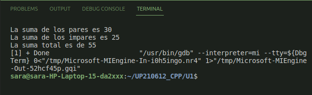
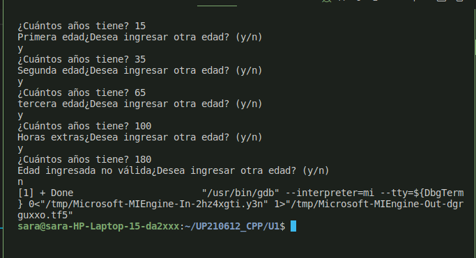
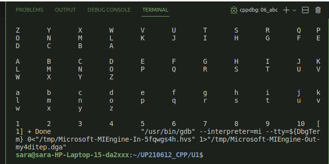

<div align=center>

# :sparkles: _Unit 1 README_ :sparkles:


## Programs done in this unit: </div>

 <a href="https://github.com/up210612/UP210612_CPP/tree/main/U1#-octocat---first-program-holacpp--"> :white_small_square: - First Program: Hola.cpp</a>

 <a href="https://github.com/up210612/UP210612_CPP/tree/main/U1#octocat--second-program-parimparcpp-"> :white_small_square: - Second program: ParImpar.cpp</a>

 <a href="https://github.com/up210612/UP210612_CPP/tree/main/U1#octocat--third-program-tiposdatoscpp-">:white_small_square: - Third program: TiposDatos.cpp</a>

 <a href="https://github.com/up210612/UP210612_CPP/tree/main/U1#octocat--fourth-program-cicloscpp-">:white_small_square: - Fourth program: ciclos.cpp</a>

 <a href="https://github.com/up210612/UP210612_CPP/tree/main/U1#octocat--fifth-program-edadescpp-">:white_small_square: - Fifth program: edades.cpp</a>

 <a href="https://github.com/up210612/UP210612_CPP/tree/main/U1#octocat--sixth-program-abccpp-">:white_small_square: - Sixth program: abc.cpp</a>

 
 <h2> 
 
 :octocat: - _First program: Hola.cpp_  </h2>

<h3>

_Description:_ Student must do a program in which she'll print a Hello world </h3>


```
#include <iostream>

using namespace std;
int main(){

    cout << "Hola Mundo"<< endl;
    return 0;

}
```

_Results_

 


 <h2>
 
 :octocat: -_Second program: ParImpar.cpp_ </h2>

<h3>  

_Description:_  A program that allows the student to print a short message of "Par o Impar" </h3>

```
#include <iostream>
using namespace std;

int main()
{
    cout <<"Par o Impar"<< endl<<endl; // (/n) para salto de linea//

    return 0;
}
```
_Results_

 

  <h2>

 :octocat: -_Third program: TiposDatos.cpp_ </h2>

<h3>  

_Description:_  A program where they can play around with the different types of variables that can be used in their code. (char, int, float, doble...)" </h3>

```
int main( )
{

    int unsigned entero = 2147483647;
    float flotante= 3.4e38;
    double grande =2.23585215828441;
    char caracter= 'A';

    cout<< "Este programa muestra los tipos de datos. \n";
    cout<< "EL numero entero es: " << entero << endl;
    cout<< "El tamaño del entero es: " <<sizeof (entero) << "bytes" << endl;
    cout<< "El caracter char es: " << caracter << endl; 
    cout<< "El tamaño del char es: " <<sizeof (caracter) << "bytes" << endl;
    cout<< "El valor de PI es: " << PI << endl; 
    cout<< "El valor de pi es: " << pi << endl; 
    getchar(); //Para correr en terminal

    /*
    cout<< 
    */
    return 0;
}
```
_Results_

 


  <h2>

 :octocat: -_Fourth program: Ciclos.cpp_ </h2>

<h3>  

_Description:_  Introduction to cycles using the structure IF to add even and odd numbers respectively. And finally add up both results. </h3>

```
#include <iostream>
using namespace std;

int main()
{
    int n = 10;
    int impar = 0;
    int par = 0;
    for (int i = 0; i <= n; i++)
    {
        if (i %2 == 0)
        {
            par = par +i;
            
        } else {
            impar= impar+i;
            // Tambien se puede poner com suma+=i;
        }
        
    }

    printf("La suma de los pares es %d \n", par);
    printf ("La suma de los impares es %d \n", impar);
    int suma= par+impar;
    printf ("La suma total es de %d \n", suma);
    
    return 0;
}
```
_Results_

 
 
 
 <h2>

 :octocat: -_Fifth program: edades.cpp_ </h2>

<h3>  

_Description:_  A program in which according to the age of the usser, a special message will be deliverd. </h3>

```
#include <iostream>
#include <stdio.h>
using namespace std;

int main ( )
{
   char a; 
   
    do {    
    int edad;
    printf ("¿Cuántos años tiene? ");
    scanf ("%d",&edad);

    if (edad>= 1 && edad <=150)
    {
        if (edad >=1 && edad <= 30)
        {
            printf ("Primera edad");

        } else if (edad>= 31 && edad <=60)
                {
                    printf ("Segunda edad");

        } else if (edad>= 61 && edad <=90)
                {   
                    printf ("tercera edad");

        } else 
                printf ("Horas extras");

        
    } else printf ("Edad ingresada no válida");
        cout<< "¿Desea ingresar otra edad? (y/n)"<<endl;
        cin>> a; 
      
    } while (a == 'y' || a=='Y'); 

}
```
_Results_

 

 <h2>

 :octocat: -_Sixth program: abc.cpp_ </h2>

<h3>  

_Description:_  A program that will print the abecedary in different order and in lower or uppercase. It will also show numbers from 1 to 10. All using cycles for.  </h3>

```
#include <iostream>
#include <stdio.h>
using namespace std;

int main()
{

    char letra = 'Z';
    for (int i = 0; i < 26; i++)
    {
        cout << letra << "\t";
        letra = letra - 1;
    }
    cout << endl;
    cout << endl;

    // Imprimir en mayúsculas y minúsculas

    letra = 'A';
    for (int i = 0; i < 26; i++)
    {
        cout << letra << "\t";
        letra = letra + 1;
    }
    cout << endl;
    cout << endl;

    char letra1 = 'a';
    for (int i = 0; i < 26; i++)
    {
        cout << letra1 << "\t";
        letra1 = letra1 + 1;
    }
    cout << endl;
    cout << endl;

    // Del 1 al 10

    
    for (int i = 1; i < 11; i++)
    {
        cout << i << "\t";
        
    }
    return 0;
}
```
_Results_

 

