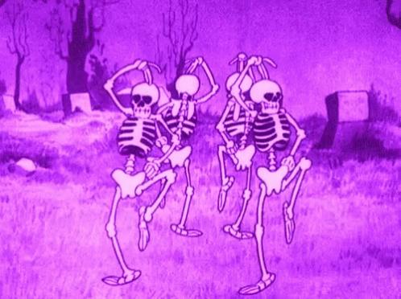
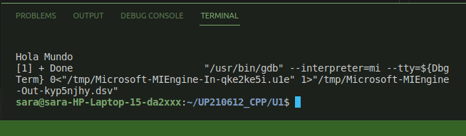

#  _Unit 1 README_ 

## Programs done in this unit: 

<a href="https://github.com/up210612/UP210612_CPP/blob/main/U1/hola.cpp"> - *_First program: Hola.cpp_* </a>

_Description:_ Student most do a program in which she'll print a Hello world 

  

:sparkles: