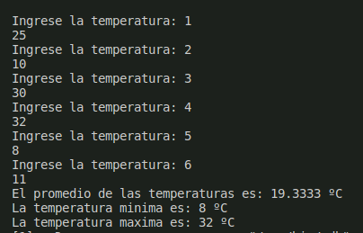

<div align=center>

# :sparkles: _Unit 2 README_ :sparkles:


## Programs done in this unit: </div>
 
 <h2> 
 - PDF exercises
 
 :octocat: - _First program: impuestos.cpp_  </h2>

<h3>

_Description:_ Write a program that asks the user for his annual income and displays the tax due. </h3>


```
#include<iostream>
#include <stdio.h>
using namespace std;

int main ( )
{

   int renta;
    printf ("¿De cuánto es su renta anual? ");
    scanf("%d", &renta);

    if (renta> 10000)
{
        if (renta <= 20000)
        {
            printf("Le corresponde un importe del 15%");
        }else if (renta<= 35000)
            {
                printf("Le corresponde un impuesto del 20%");
            }else if (renta <= 60000)
               { printf("EL impuesto que le corresponde es del 30%");

                 }else printf("El impuesto que le corresponde es del 45%");

}else printf("Le corresponde un impuesto del 5%");

return 0;

}
```

_Results_

 
 


 <h2>
 
 :octocat: -_Second program: rendimiento.cpp_ </h2>

<h3>  

_Description:_  Write a program that reads the user's score and indicates his performance level, as well as the amount of money the user will receive. </h3>

```

#include<iostream>
#include <stdio.h>
#include <cmath>
using namespace std;

int main ( ){
 
  char ev;
 do
 {

    char op;
    int valor=2400;

    cout<<"La puntuación de su empleado fue"<< endl<< "a) 0.0" << endl << "b) 0.4" << endl<< "c) 0.6"<<endl;
    cin>> op; 

    switch (op)
    {
    case 'a':
        cout<< "El nivel de rendimiento del empleado fue inaceptable, por lo que se le otorga un beneficio de $" << 0.0*valor << endl; 
        break;

    case 'b':
        cout<< "El nivel de rendimiento del empleado fue aceptable, por lo que se le otorga un beneficio de $" << 0.4*valor << endl; 
        break;

    case 'c':
        cout<< "El nivel de rendimiento del empleado fue meritorio, por lo que se le otorga un beneficio de $" << 0.6*valor << endl;
        break;

    default:
        cout<< "Opción ingresada no válida."<<endl; 
        break;
    }

    cout<< "¿Desea evaluar a otro empleado? (y/n)"<<endl;
    cin>> ev;
    
 }  while  (ev == 'y' || ev == 'Y');

}

```
_Results_

 

  <h2>

 :octocat: -_Third program: salaJuegos.cpp_ </h2>

<h3>  

_Description:_  Write a program for a company that has arcades for all ages and wants to automatically calculate the price it should charge its customers to enter. </h3>

```
#include <iostream>
#include <stdio.h>
using namespace std;

int main (){
    
    int e;
    cout << "¿Qué edad tiene?" << endl;
    cin>>e;

    if (e>=4)
    {
        if (e>18){

            cout<< "Precio de su entrada es de $10"<<endl;

        }else

            cout<<"Precio de su entrada  es de $5"<<endl;

    } else 

        cout<< "Puede entrar gratis"<<endl;


}
```
_Results_

 
 


  <h2>

 :octocat: -_Fourth program: pizza.cpp_ </h2>

<h3>  

_Description:_  Write a program that asks the user what kind of pizza he prefers with all the ingredients to choose. </h3>

```
#include <iostream>
#include <stdio.h>
using namespace std;

int main(){

    char res;
    char select;
    
    cout << "Bienvenido a Bella Napoli" << endl;
    cout << "¿Desea ordenar una pizza vegetaria? (y/n)" << endl;
    cin >>res;

    if (res == 'y' || res == 'Y'){

        
        cout << "Seleccione el ingrediente que quiere agregar a su pizza (a/b)"<< endl;
        cout << "a) Pimiento" << endl << "b) Tofu"<< endl;
        cin >> select;

        if(select == 'a'){
            cout << "Pizza vegetariana con Pimiento" << endl;
        } else {
            cout << "Pizza vegetariana con Tofu" << endl;
        }
    } else {

        cout << "Seleccione el ingrediente que quiere agregar a su pizza (a/b/c)" << endl;
        cout << "a) Peperoni" << endl << "b) Jamón"<< "c)Salmón" << endl;
        cin >> select;

        if (select == 'a' || select == 'b'){

            if (select == 'a'){

                cout << "Pizza no vegetariana con Peperoni" << endl;
            } else {
                cout << "Pizza no vegetariana con Jamón" << endl;
                }
        } else {
            cout << "Pizza no vegetariana con Salmón" << endl;
        }
    }
}


```
_Results_

 
 

 
 
 <h2>

 :octocat: -_Fifth program: temperatura.cpp_ </h2>

<h3>  

_Description:_  Make a program in which you enter 6 temperatures and determine the average, the lowest and the highest one. </h3>

```
#include <iostream>
using namespace std;

int main()
{
    float t, sum=0, max=-100, min=100;
    for (int i = 0; i < 6; i++)
    {
        cout<<"Ingrese la temperatura: "<<i+1<<endl;
        cin>>t;
        sum=sum+t;
        if (min>t)
        {
            min=t;
        }
        if (max<t)
        {
            max=t;
        }
    }
    cout<<"El promedio de las temperaturas es: "<<sum/6<<" ºC"<<endl;
    cout<<"La temperatura minima es: "<<min<<" ºC"<<endl;
    cout<<"La temperatura maxima es: "<<max<<" ºC"<<endl;
    return 0;
}
```
_Results_

 

 <h2>

 :octocat: -_Sixth program: productos.cpp_ </h2>

<h3>  

_Description:_ Create a program that reads indefinitely quantities of products and their price, and at the end shows the total.  </h3>

```
#include <iostream>
#include <stdio.h>
using namespace std;

int main(){

    int i=1;
    int precio, sum=0; 

    cout<< "Sumador de productos indefinidos. "<<endl<<"Nota: En caso de ya no querer agregar más productos, ingrese 0"<< endl;

    do
    {  
        
       cout << "Ingrese el precio de su producto "<< i << endl;
       cin>> precio; 
       sum=sum+precio;
       i++;
    } while (precio != 0);
    
    cout<< "Usted compró "<<i-2<<" productos. Con costo total de $"<< sum<<endl;
    return 0;
}
```
_Results_

 

<h2>

 :octocat: -_Seventh program: bin2dec.cpp_ </h2>

<h3>  

_Description:_ Create a program that performs binary to decimal conversion.  </h3>

```
#include <iostream>
#include <stdio.h>
#include <math.h>
using namespace std; 

int main (){

    string bin; 
    int largo,i, sum=0;
    cout<< "Ingrese número binario a convertir. Sin espacios."<<endl; 
    cin>>bin; 
    largo= bin.length();
  
    for (i = largo-1; i>=0; i--)
    {
        if (bin[i]== '1')
        {
            sum=  sum + pow(2,((largo-1)-i));
        }
     
    }

    cout << "EL número ingresado, en decimal es igual a "<< sum<<endl;
    

}

```
_Results_

 


## Class exercises done in this unit: </div>

 <a href="https://github.com/up210612/UP210612_CPP/blob/main/U2/E05BreakCOntinuos.cpp"> :white_small_square: - Break Continous.cpp</a>

 <a href="https://github.com/up210612/UP210612_CPP/blob/main/U2/E06SUmatoria.cpp"> :white_small_square: - Sumatoria.cpp</a>

 <a href="https://github.com/up210612/UP210612_CPP/blob/main/U2/E07Factorial.cpp">:white_small_square: - Factorial.cpp</a>

 <a href="https://github.com/up210612/UP210612_CPP/blob/main/U2/E11FUnciones.cpp">:white_small_square: - Funciones.cpp</a>

 <a href="https://github.com/up210612/UP210612_CPP/blob/main/U2/E1_tablas.cpp">:white_small_square: - Tablas.cpp</a>

 <a href="https://github.com/up210612/UP210612_CPP/blob/main/U2/cicloWhile.cpp">:white_small_square: - Ciclo while.cpp</a>

 <a href="https://github.com/up210612/UP210612_CPP/blob/main/U2/compraProd.cpp">:white_small_square: - Compra productos.cpp</a>

 <a href="https://github.com/up210612/UP210612_CPP/blob/main/U2/rentas.cpp">:white_small_square: - Rentas.cpp</a>

 <a href="https://github.com/up210612/UP210612_CPP/blob/main/U2/switchCase.cpp">:white_small_square: - Switch Case.cpp</a>